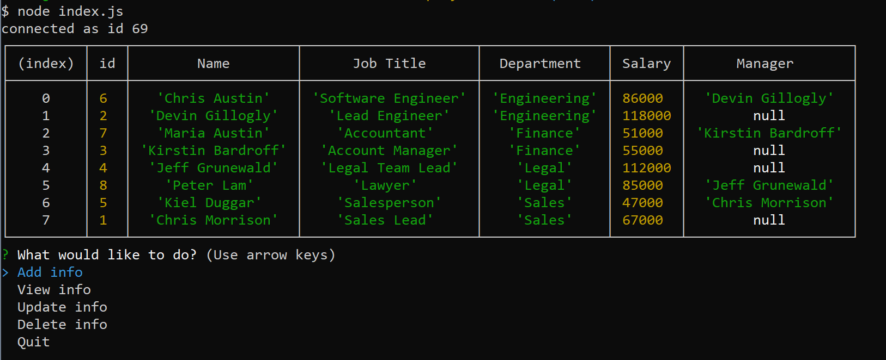
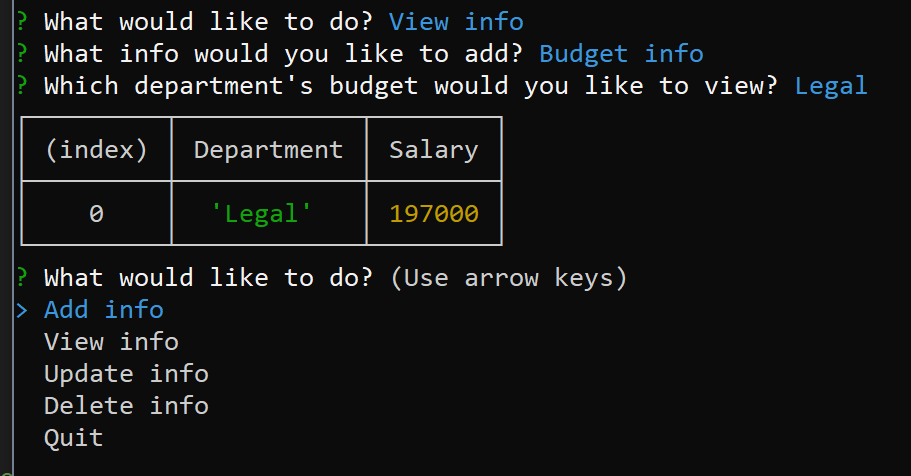
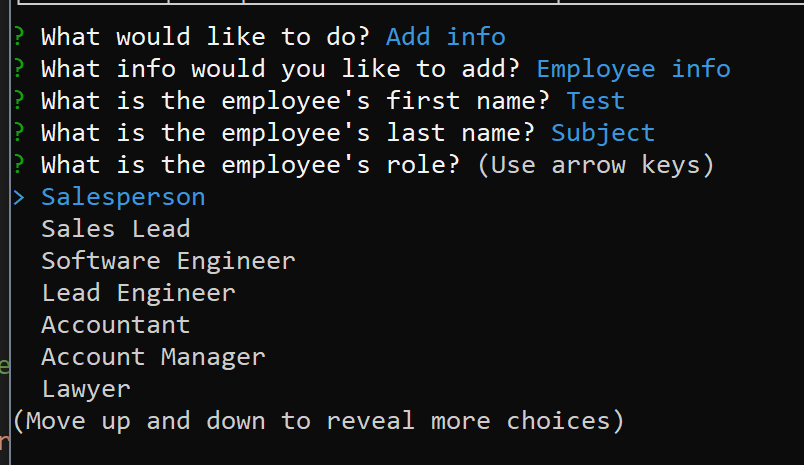

# **hw12-employee-tracker**
  
  
  
  ## **Description**
  
  Create and utilize a schema based on a provided ERD consisting of 3 tables. One for department, one for role, and one for employee. With a CLI, allow the user to add departments, roles, and employees. View departments, roles, and employees. Update employee roles. Update employee managers. View employees by manager. Delete departments, roles, and employees. View the total utilized budget of a department (combined salaries of all employees in that department).
  <br><br>
  
  ## **Table of Contents**
  
  * [Installation](#Installation)
  * [Usage](#Usage)
  * [License](#License)
  * [Contributing](#Contributing)
  * [Technology](#Technology)
  * [Questions](#Questions)
  
  <br><br>
  
  ## **Installation**
  
  1. Clone the repo
  ```sh
  git clone https://github.com/virlym/hw-12-employee-tracker.git
  ``` 
  2. Install NPM packages
  ```sh
  npm install
  ```
  <br><br>
  
  ## **Usage**
  Here are some images and a link to a video demo showing some of the functionality of the project. Keep in mind that the employee needs a role, which needs a department. If a department is deleted, all the roles in that department will also be deleted, as well as all the employees with those roles. However, if a manager is removed, the employees under that manager will just be updated to no longer have a manager.

  [Demo Link](https://drive.google.com/file/d/1KLDXeC43pQV2t8PJQLBYDPMIl0Jx2b08/view)

  

  
  
  

  <br><br>
  
  ## **License**
  
  Distributed under the MIT License.
  <br><br>
  
  ## **Contributing**
  Contributions are what make the open source community such an amazing place to be learn, inspire, and create. Any contributions you make are **greatly appreciated**.
  
  1. Fork the Project
  2. Create your Feature Branch (`git checkout -b feature/AmazingFeature`)
  3. Commit your Changes (`git commit -m 'Add some AmazingFeature'`)
  4. Push to the Branch (`git push origin feature/AmazingFeature`)
  5. Open a Pull Request
  
  <br><br>
  
  ## **Technology**
  - [JavaScript](https://www.javascript.com/)
  - [npm MySQL](https://www.npmjs.com/package/mysql)
  - [npm Inquirer](https://www.npmjs.com/package/inquirer)
  - [Node.js](https://nodejs.org/en/)
  <br><br>
  
  ## **Questions**
  Learn about more of my work at [my GitHub](https://github.com/virlym)
  
  You can send any additional questions to my email : virlym@gmail.com
  <br><br><br><br>
